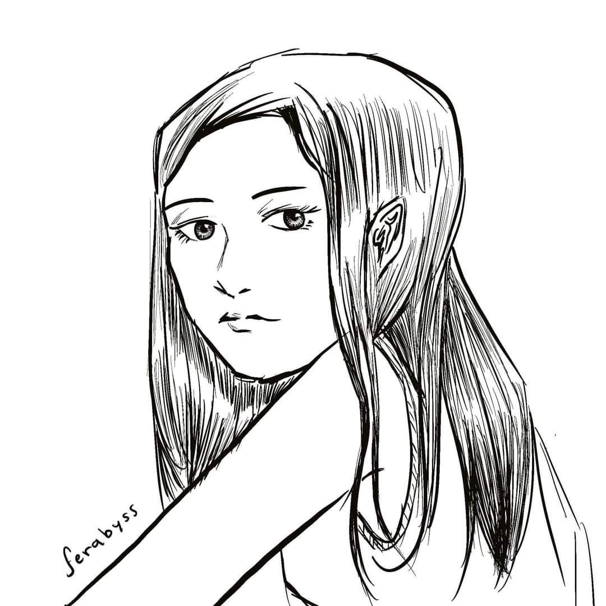

# Ferabyss
## María Fernanda Martínez Vázquez

María Fernanda Martínez Vázquez, también conocida como Ferabyss, es una artista mexicana cuya obra explora las emociones intensas a través de diferentes técnicas, especialmente la pintura al óleo, la acuarela y el acrílico. Desde pequeña, su pasión por el dibujo la llevó a utilizar el arte como una forma de expresar lo que las palabras no podían comunicar. Influenciada por el anime en sus primeros años, ha logrado desarrollar un estilo único que fusiona la fantasía oscura, la mitología celta y maya, así como elementos surrealistas.

A lo largo de su carrera, ha participado en diversas exposiciones y concursos de pintura, destacando su participación en el Encuentro Nacional de Arte Contemporáneo (ENAC) en 2018, donde obtuvo el tercer lugar, y en 2019, logrando el primer lugar estatal en pintura. Además, ha sido parte del Interpolitécnico de Pintura en 2023 y expondrá próximamente en el Centro Cultural Jaime Torres Bodet para el Interpolitécnico de Pintura 2024.

Su formación artística incluye estudios en el taller del Museo de la Caricatura en la Ciudad de México, donde fue guiada por artistas como Artemio Guevara, Mario Guevara y Nacho. Esta formación le permitió perfeccionar sus habilidades y adquirir una apreciación por la caricatura y el cómic.

El arte de María Fernanda es un viaje introspectivo donde cada pincelada es una exploración de emociones como ansiedad, depresión y furia, plasmadas en mundos imaginarios inspirados en sus sueños y visiones. Su principal motivación es crear narrativas y universos fantásticos que permitan a los espectadores adentrarse en los lugares que ella imagina.

Para ella, el dibujo y la pintura son caminos difíciles pero valiosos, y su consejo a los nuevos artistas es que no se desesperen por encontrar un estilo propio: "El estilo es algo que surge de manera natural, esporádico, personal y sincera, así que no lo fuercen". Su meta es seguir pintando y creando obras que, con el tiempo, merezcan tener su propia exposición, invitando a todos a conocer y disfrutar de su visión del mundo.

## Sus redes sociales son:

 

